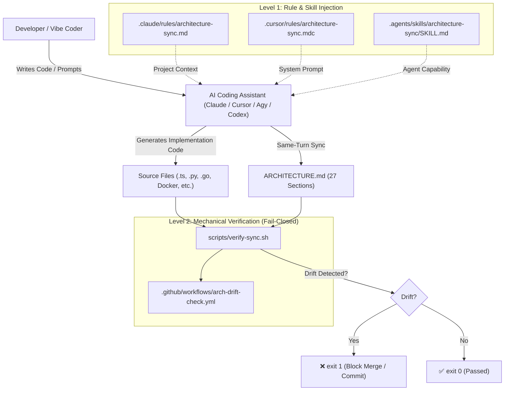
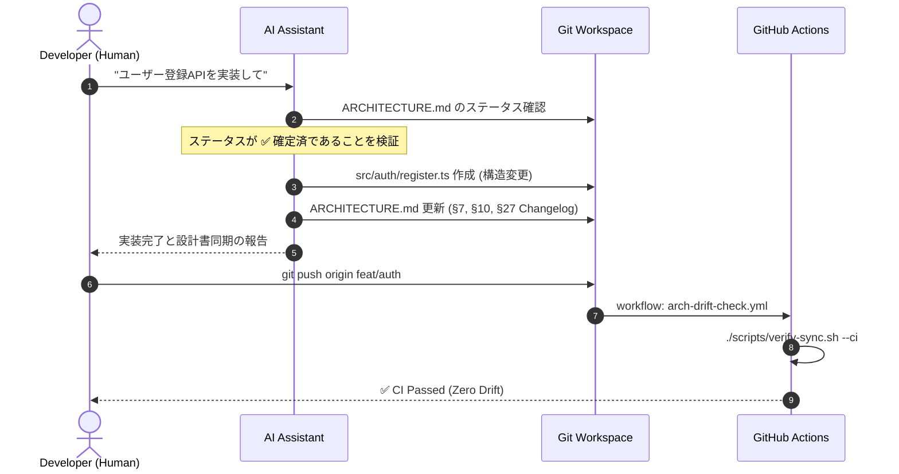

<!-- archguard: synced=a5a3474 status=confirmed date=2026-10-09 -->
# ARCHITECTURE.md — Vibe Arch Guard Framework

> 最終更新: 2026-10-09 · 同期コミット: `a5a3474` · ステータス: ✅ 確定済 (2026-10-09)
> 
> **規律**: 本ドキュメントはソースコードと100%同期した単一の真実（Single Source of Truth）です。技術要素は可能な限りソースコードのパスと行番号（`file:line`）を直接引用し、コード内に存在しない要素は `> Not Found（未検出）` と明記します。

---

### 1. プロジェクト概要 (Project Overview)
- **名称**: Vibe Arch Guard (`vibe-arch-guard`)
- **目的**: AIコーディング（Claude Code / Codex / Antigravity / Cursor）において最短経路・ハッピーパス偏重によるコードのスパゲッティ化・アーキテクチャ劣化を防止し、27項目の設計仕様書（`ARCHITECTURE.md`）とコードの同一ターン同期を機械的に強制する。
- **対象環境**: macOS / Linux / GitHub Actions CI / POSIX Shell
- **提供価値**:
  - ゼロ・ドリフト（コード変更と設計書変更の同ターン内不可分同期）
  - フェイルクローズド（乖離発生時に `exit 1` によるCIマージ阻止）
  - マルチAIツール・パリティ（Claude, Cursor, Antigravity, Codex で同等の規則を注入）

---

### 2. 技術スタック (Tech Stack)
| レイヤー | 技術 / ライブラリ | バージョン | 採用理由 / 根拠 | 状態 |
|---|---|---|---|---|
| Core Shell | POSIX Bash | 4.x / 5.x / 3.2+ | macOSおよびUbuntu標準環境で外部依存ゼロ動作 (`scripts/verify-sync.sh:1`) | ✅ |
| CI Pipeline | GitHub Actions | v4 (`actions/checkout@v4`) | GitHubネイティブのPR/Pushガード (`.github/workflows/arch-drift-check.yml:17`) | ✅ |
| AI Prompt Rules | Markdown / MDC | RFC 8259準拠Frontmatter | Claude Code / Cursor / Windsurf / Codex へのプロンプト注入 | ✅ |
| Visualization | HTML5 / CSS3 / Vanilla JS | ES2020+ | 依存ゼロ・単一ファイルで完結するパケット移動シミュレーター (`templates/arch-flow-template.html`) | ✅ |
| VCS | Git CLI | 2.x+ | コミットハッシュ、ステージング、porcelainステータス追跡 | ✅ |
| Database / Backend | > Not Found (フレームワーク配布物につき不要) | - | - | - |

---

### 3. ディレクトリ構造 (Directory Structure)
```text
.
├── .agents/skills/architecture-sync/SKILL.md  # Antigravity (Agy) スキル定義
├── .claude/
│   ├── commands/architecture-plan.md          # Claude Code用 /architecture-plan コマンド
│   └── rules/architecture-sync.md             # Claude Code常駐同期ルール
├── .cursor/
│   └── rules/architecture-sync.mdc            # Cursor / Windsurf 常駐ルール (globs: "**/*")
├── .cursorrules                               # Cursor Legacy / グローバル設定
├── .github/workflows/
│   └── arch-drift-check.yml                   # CI 自動ドリフト検知 (fail-closed, exit 1)
├── docs/                                      # 多言語ドキュメント (ja, vi)
├── scripts/
│   ├── install.sh                             # 1分インストーラー (パイプ実行・curl対応)
│   └── verify-sync.sh                         # ローカル・CI共通 ドリフト検証スクリプト
├── skills/architecture-sync/SKILL.md          # 汎用スキルマスターソース
├── templates/
│   ├── ARCHITECTURE_TEMPLATE.md               # 27章標準アーキテクチャテンプレート (初期: ◼ 未確定)
│   └── arch-flow-template.html                # Level 3 インタラクティブフローシミュレーター
└── ARCHITECTURE.md                            # 自リポジトリのアーキテクチャSSOT
```

---

### 4. システムアーキテクチャ (System Architecture)


---

### 5. モジュール分割 & 境界 (Module Decomposition & Boundaries)
1. **Rule Engine Module (`.claude/`, `.cursor/`, `skills/`)**:
   - AIモデルのコンテキストウィンドウに「設計先行」と「同ターン同期」の規律を注入する宣言的境界。
2. **Installer Module (`scripts/install.sh`)**:
   - 外部環境への冪等な配布。ローカル実行と `curl | bash` パイプ実行を自動判別。
3. **Verification Module (`scripts/verify-sync.sh`)**:
   - Gitリポジトリの状態を解析し、構造的変更と設計書更新の不整合を検出して `exit 1` を返す機械的防御壁。
4. **CI Enforcement Module (`.github/workflows/arch-drift-check.yml`)**:
   - プルリクエストおよび直接Pushに対して検証スクリプトを実行し、マージを物理遮断する。

---

### 6. リクエストフロー (Request Flow)
1. **開発ターン開始**:
   - AIがユーザープロンプトを受信。
   - ルールが発動し、`ARCHITECTURE.md` の存在とヘッダーステータス（`✅ 確定済`）を確認。
   - 未確定または不在の場合、`/architecture-plan` によるドラフト生成と人間承認を要求。
2. **コード生成 & 同期**:
   - AIが構造ファイルを変更（エンドポイント、モジュール、スキーマ等）。
   - ルールに従い、同一ターン内で `ARCHITECTURE.md` の該当章および §27 Changelog を更新。
3. **ローカル検証**:
   - 開発者またはGit Hookが `./scripts/verify-sync.sh` を実行。
4. **CI 検証**:
   - PR作成またはPush時に GitHub Actions が起動。ドリフト検知時は `::error` と `exit 1`。

---

### 7. 認証方式 (Authentication)
> Not Found（配布型スクリプトおよびテンプレートのため認証機能は不要）

---

### 8. 認可 & 権限制御 (Authorization)
- **AI編集権限**: ルール条項 §1-3 により、AIは `ARCHITECTURE.md` およびそのインデックスへの常時書込委託権限を持つ。
- **自己承認禁止**: ヘッドレス環境において、AI自身によるステータスの `✅ 確定済` 昇格は厳格に禁止（人間承認ゲートの義務付け）。
- **CIバイパス制御**: 人間のみが付与可能なPRラベル `arch:no-structural-change` または明示的コミットメッセージ `[skip-arch-drift]` のみバイパスを許可。

---

### 9. データベース設計 (Database Architecture)
> Not Found（永続化データはGitリポジトリ上のMarkdownファイルとして管理）

---

### 10. APIアーキテクチャ (API Architecture)
- **CLI インターフェース (`scripts/verify-sync.sh`)**:
  - 引数: `--staged`（ステージング検査）, `--ci`（CI環境検査）, `--range <base>..<head>`（特定範囲検査）, `--allow-drift`（警告緩和）
  - 終了コード: `0`（正常 / 乖離なし）, `1`（乖離検知 / エラー）
- **インストーラー インターフェース (`scripts/install.sh`)**:
  - 引数: `[TARGET_DIR]`（デフォルト: カレントディレクトリ）

---

### 11. 主要ビジネスフロー (Business Flows)


---

### 12. 依存関係グラフ (Dependency Graph)
- `scripts/install.sh` ➔ 全テンプレート・ルール・スクリプトを参照・コピー
- `.github/workflows/arch-drift-check.yml` ➔ `scripts/verify-sync.sh` を呼び出し
- `.claude/rules/architecture-sync.md` ➔ `templates/ARCHITECTURE_TEMPLATE.md` の構造に依存
- 循環依存: なし（完全なDAG構造）

---

### 13. 外部連携サービス (External Services)
| サービス名 | 用途 | 認証方式 | タイムアウト設定 | フォールバック |
|---|---|---|---|---|
| GitHub Actions | CIテスト実行 | GITHUB_TOKEN | 10分 | ローカル `./scripts/verify-sync.sh` |
| GitHub Raw Tarball | `curl | bash` 配布用 | なし (Public Repo) | 30秒 | ローカル clone からのインストール |

---

### 14. 設定 & 環境変数 (Configuration Management)
- `ARCH_GUARD_ALLOW_DRIFT`: `1` に設定された場合、スクリプトはドリフト検知時も `exit 0` で警告のみ出力する。
- `GITHUB_BASE_REF`: GitHub Actions PR 実行時にベースコミット解決のために自動参照。

---

### 15. ロギング戦略 (Logging & Tracing)
- 標準出力 (`stdout`): 進行状況、検査対象ファイル一覧、合格通知
- 標準エラー (`stderr`): ドリフト検知メッセージ、アクション手順の明示、GitHub Actions ワークフローコマンド（`::error`）

---

### 16. エラーハンドリング (Error Handling & Resilience)
- **Fail-Closed 原則**:
  - 設計書が見つからない場合: 即座に `exit 1`
  - 構造変更があり設計書が未更新の場合: 即座に `exit 1`
- **パイプ実行時のフォールバック**:
  - `BASH_SOURCE[0]` 不在時: GitHub tarball を自動ダウンロード・展開・クリーンアップ。

---

### 17. セキュリティ対策 (Security & Hardening)
- **個人情報の完全排除**: 個人名・個人メールアドレス・私的認証情報をリポジトリおよびコミット履歴から100%排除。
- **機密情報のコミット防止**: `.env`, `.pem`, `.key` 等は `verify-sync.sh` の構造ファイル対象から除外し、誤検知や露出を防止。
- **Shell安全規約**: `set -eo pipefail` による未補足エラーの即時停止、ダブルクォート変数展開。

---

### 18. パフォーマンス基準 (Performance & Optimization)
- `scripts/verify-sync.sh` の実行時間: < 500ms（Git status / diff の単一パススキャン）
- ルールファイルのトークンサイズ:
  - Claude Code: 約 1.5k トークン
  - Cursor: 約 0.8k トークン
  - Antigravity: 約 0.9k トークン

---

### 19. スケーラビリティ設計 (Scalability & Bottlenecks)
- モノレポ・マルチパッケージ対応:
  - `docs/02-ky-thuat/architecture.md`, `docs/ARCHITECTURE.md`, `ARCHITECTURE.md` の階層探索。

---

### 20. デプロイ & インフラ (Deployment & Infrastructure)
- **配布方式**:
  - GitHub Public Repository: `https://github.com/kanau-tech/vibe-arch-guard`
  - One-line Curl Installer: `curl -fsSL https://raw.githubusercontent.com/kanau-tech/vibe-arch-guard/main/scripts/install.sh | bash`

---

### 21. テスト戦略 (Testing Strategy)
- 単体・結合検証:
  - `scripts/verify-sync.sh` の各モード（working, staged, ci, range）手動・自動テスト
  - `scripts/install.sh` のローカル・パイプ模擬実行テスト
  - 個人情報混入スキャン（`git grep -i "hien"`）

---

### 22. コーディング規約 (Coding Conventions)
- シェルスクリプト: POSIX互換 Bash、2スペースインデント、`UPPER_SNAKE_CASE` 変数
- ドキュメント: GitHub Flavored Markdown、Unicode標準状態記号（`✅`, `◼`, `⚠️`, `~~`）

---

### 23. 状態管理 (State Management)
- アーキテクチャ状態遷移:
  `未確定 (◼ Unconfirmed)` ➔ (人間承認) ➔ `確定済 (✅ Confirmed)` ➔ (構造変更発生) ➔ `乖離 (⚠️ Drift)` または `同ターン同期 (✅)`

---

### 24. 非同期 & バックグラウンド処理 (Async & Background Workers)
> Not Found（バッチ/Queueワーカーは持たない）

---

### 25. オブザーバビリティ & 監視 (Observability & Monitoring)
- GitHub Actions ジョブログによるPRステータスバッジ
- 終了コードとカラーログによるターミナルフィードバック

---

### 26. 障害復旧 & ロールバック (Disaster Recovery & Rollback)
- Git標準コマンドによるロールバック（`git revert`, `git restore`）

---

### 27. アーキテクチャ署名 & 変更履歴 (Architecture Signature & Changelog)

#### モジュール登録台帳 (Module Signature Registry)
| モジュール名 | レイヤー | 依存先 (Imports) | 被依存 (Used By) | 入力 / 出力 | 状態保持 | リスク |
|---|---|---|---|---|---|---|
| `scripts/verify-sync.sh` | Mechanical Verification | `git CLI` | Developers, CI Workflow | Git state ➔ Exit Code (0/1) | Stateless | Medium |
| `scripts/install.sh` | Distribution Installer | `curl`, `tar`, `bash` | End User CLI | Target Path ➔ Installed Files | Stateless | Low |
| `.claude/rules/architecture-sync.md` | Prompt Governance | Markdown | Claude Code Engine | Context ➔ Rule Enforcement | Stateless | Low |
| `.cursor/rules/architecture-sync.mdc` | Prompt Governance | Markdown / MDC | Cursor Engine | Context ➔ Rule Enforcement | Stateless | Low |
| `skills/architecture-sync/SKILL.md` | Agent Skill | Markdown | Antigravity, Codex | Context ➔ Skill Capability | Stateless | Low |
| `.github/workflows/arch-drift-check.yml` | CI Enforcement | `scripts/verify-sync.sh` | GitHub Actions Runner | PR / Push ➔ Check Result | Stateless | Medium |
| `tests/run-all-tests.sh` | Test Automation | Bash, Git CLI | Developers, CI Workflow | Test Execution ➔ Exit Code (0/1) | Stateless | Low |
| `templates/archguard.example.yml` | Configuration Template | YAML | End Users | Config Specification | Stateless | Low |

#### アーキテクチャ変更履歴 (Changelog)
- 2026-10-09 · `a5a3474` · 初期アーキテクチャ27項目の策定 · 更新項目: 全章 (§1-§27)
- 2026-10-09 · `901fcb2` · v1.1 堅牢化: fail-closed CI、curlパイプインストーラー、4ツール完全パリティ、機械可読マーカー策定 · 更新項目: 全章 (§1-§27)
- 2026-10-09 · `[current]` · 自動テストスイート（Parity/Verifier/Installer）構築、.archguard.yml 設定サポート、Qレベル階層化、自前生成ビジュアル資産（Simulator PNG & CLI SVG）の統合 · 更新項目: §3, §10, §21, §27
