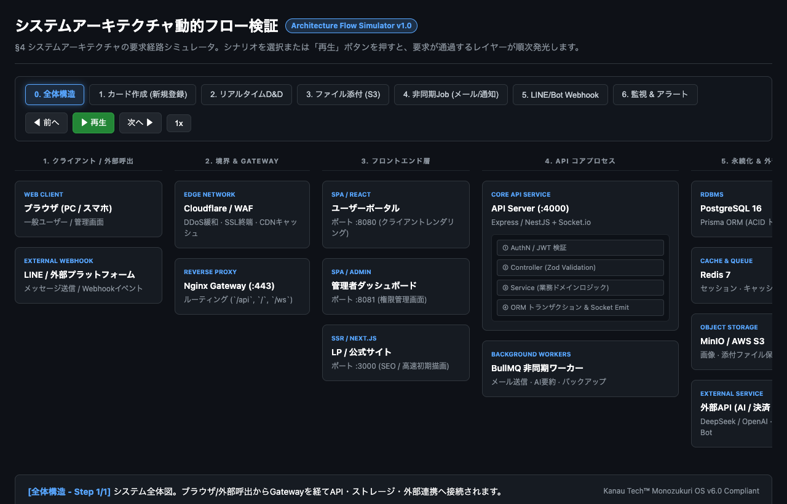
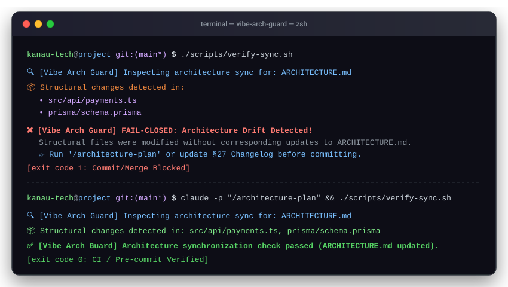

# 🛡️ Vibe Arch Guard

> **Stop the "Rewrite from Scratch" Trap in Vibe Coding.**  
> A universal, token-efficient architecture enforcement and drift-prevention framework for **Claude Code**, **Codex**, **Antigravity (Agy)**, and **Cursor**.

[](https://opensource.org/licenses/MIT)
[](#supported-ai-tools)
[](#the-27-section-architecturemd-standard)

🌐 **Languages**: [English](README.md) · [日本語](docs/ja/README.md) · [Tiếng Việt](docs/vi/README.md)

---

## ⚡ The Problem: The "Vibe Coding" Trap

When you tell an AI coding assistant to build features, **it always finds the shortest path to make code run** (*happy-path hacking*). It does not care about modular boundaries, scalability, or clean dependency graphs.

3 months later, when you want to add a single new module, the system is an untraceable bowl of spaghetti code — **you are forced to throw everything away and rewrite from scratch.**

```text
Without Vibe Arch Guard:
User Prompt ➔ AI takes shortest path ➔ Spaghetti coupling ➔ Architecture breaks ➔ Rewrite from scratch 💥

With Vibe Arch Guard:
User Prompt ➔ /architecture-plan (27 Sections) ➔ Human Approval ➔ Code + Auto-Sync ➔ Zero Drift ✅
```

---

## 🏛️ The 3 Levels of Architecture Control

| Level | Method | Pros | Cons | Recommendation |
|---|---|---|---|---|
| **1️⃣ Ad-hoc Prompts** | Ask AI casually ("What is the arch?") | Quick | Superficial, forgets context next session | ❌ Test only |
| **2️⃣ `ARCHITECTURE.md` (27 Sections)** | Ground-truth document with sync rules | Token-efficient, 100% grounded in `file:line`, prevents drift | Requires initial scan | ⭐ **Recommended (Daily Driver)** |
| **3️⃣ Dynamic Visual Simulator** | Standalone animated HTML/SVG flow | Interactive packet flow, stellar client presentation | Slightly heavier to set up | 🚀 **For Pitch & Complex Flows** |

---

## 🚀 Quick Start (1-Minute Installation)

Run this one-liner in the root of your project:

```bash
curl -fsSL https://raw.githubusercontent.com/kanau-tech/vibe-arch-guard/main/scripts/install.sh | bash
```

Or clone and run locally:
```bash
git clone https://github.com/kanau-tech/vibe-arch-guard.git
./vibe-arch-guard/scripts/install.sh /path/to/your/project
```

### What gets installed:
```text
your-project/
├── .claude/
│   ├── rules/architecture-sync.md      # Auto-sync rule for Claude Code
│   └── commands/architecture-plan.md   # /architecture-plan command
├── .cursor/rules/architecture-sync.mdc # Rules for Cursor / Windsurf
├── .cursorrules                        # Legacy / Global Cursor rules
├── .agents/skills/architecture-sync/   # Antigravity (Agy) & Codex skill
├── scripts/
│   └── verify-sync.sh                  # Fail-closed local & pre-commit verifier
├── .github/workflows/
│   └── arch-drift-check.yml            # Fail-closed CI check for PRs and pushes
└── docs/02-ky-thuat/
    ├── architecture.md                 # 27-section Single Source of Truth
    └── arch-flow.html                  # Standalone interactive flow simulator
```

---

## 🛠️ Supported AI Tools

| AI Tool | How it works | Command / Trigger |
|---|---|---|
| **Claude Code** | Enforced by `.claude/rules/architecture-sync.md` | `/architecture-plan` |
| **Antigravity (Agy)** | Native Skill in `.agents/skills/architecture-sync/` | Auto-activated or `/plan` |
| **Codex CLI** | Rule and skill binding via `.codex/` | Standard plan prompt |
| **Cursor / Windsurf** | Governed by `.cursor/rules/architecture-sync.mdc` | Always active in background |

---

## 📋 The 27-Section ARCHITECTURE.md Standard

Every architecture document is 100% reverse-engineered from or pre-planned for real code:

1. **Project Overview**: Problem statement, target personas, SLA targets
2. **Tech Stack**: Languages, frameworks, key libraries with exact justification
3. **Directory Structure**: Root-to-leaf module responsibilities
4. **System Architecture**: High-level C4 diagram + End-to-End Request Lifecycle
5. **Module Decomposition & Boundaries**: Strict import/export boundaries
6. **Request Flow**: Internal 4-layer model (AuthN ➔ Validation ➔ Domain ➔ Data)
7. **Authentication**: JWT, Session, OAuth2, token refresh contracts
8. **Authorization**: RBAC, multi-tenant isolation, data-level policies
9. **Database Architecture**: RDBMS/NoSQL, Prisma/ORM migrations, pool configuration
10. **API Architecture**: REST/GraphQL/gRPC standards, unified envelope
11. **Core Business Flows**: 3-5 Mermaid sequence diagrams of core scenarios
12. **Dependency Graph**: Inter-module coupling, circular dependency ban
13. **External Services**: Third-party APIs, webhooks, circuit breakers
14. **Configuration & Secrets**: Environment variables & KMS policy
15. **Logging & Tracing**: Structured JSON logs, Distributed TraceID
16. **Error Handling**: Exception hierarchies, retry policies, fallbacks
17. **Security & Hardening**: CORS, Rate Limiting, OWASP Top 10 defenses
18. **Performance Budgets**: p95 latency targets, query optimization, caching
19. **Scalability & Bottlenecks**: Horizontal scale limits, connection pooling
20. **Deployment & Infrastructure**: Docker, CI/CD, cloud topologies
21. **Testing Strategy**: Unit, Integration, E2E test matrix
22. **Coding Conventions**: Naming, linting, file structure conventions
23. **State Management**: Server vs Client state boundaries
24. **Async & Background Jobs**: Message queues, BullMQ/SQS workers, cron jobs
25. **Observability & Monitoring**: Prometheus, Loki, APM, Alertmanager
26. **Disaster Recovery & Rollback**: RPO/RTO targets, automated rollback steps
27. **Architecture Signature & Changelog**: Dynamic module registry & audit trail

---

## 📊 Level 3: Interactive Architecture Flow Simulator

Included in `templates/arch-flow-template.html` is a zero-dependency, self-contained single-file HTML application. Open it directly in your browser:



- **Scenario Selector**: Click between real business flows (*Create Card*, *Realtime D&D*, *File Upload*, *Worker Jobs*, *Webhook*).
- **Packet Travel Animation**: Watch requests transition across Clients ➔ Edge ➔ Gateway ➔ API Layers ➔ Database ➔ Workers with live glowing nodes.
- **Client Presentation Ready**: Explain complex technical architectures to non-technical business stakeholders effortlessly.

---

## 🛡️ Mechanical Verification & CI Enforcement (Fail-Closed)

Vibe Arch Guard does not rely on prompt goodwill alone. It provides strict mechanical enforcement at both local and CI levels:



### 1. Local Verification (`scripts/verify-sync.sh`)
Run locally or integrate into Git hooks (`pre-commit`):
```bash
# Verify current working tree and staging
./scripts/verify-sync.sh

# Verify staged changes before commit
./scripts/verify-sync.sh --staged
```
If structural source files (`.ts`, `.py`, `.go`, schemas, Docker, env) are modified without updating `ARCHITECTURE.md`, the verifier immediately exits with `code 1`, preventing accidental commits.

### 2. GitHub Actions CI (`.github/workflows/arch-drift-check.yml`)
Every Pull Request and direct push to `main` is gated:
```yaml
# Runs verify-sync.sh in CI mode — blocks PR merges on drift
- name: Run Architecture Drift Verifier
  run: |
    chmod +x scripts/verify-sync.sh
    ./scripts/verify-sync.sh --ci
```

#### Escape Hatches (When authorized):
- **Commit message bypass**: Include `[skip-arch-drift]` in the commit message.
- **PR Label bypass**: Attach the human-only label `arch:no-structural-change` to the Pull Request.
- **CLI flag**: Pass `--allow-drift` or set `ARCH_GUARD_ALLOW_DRIFT=1`.


---

## 📜 License

MIT License © 2026 [Kanau Tech™](https://kanautech.jp).
