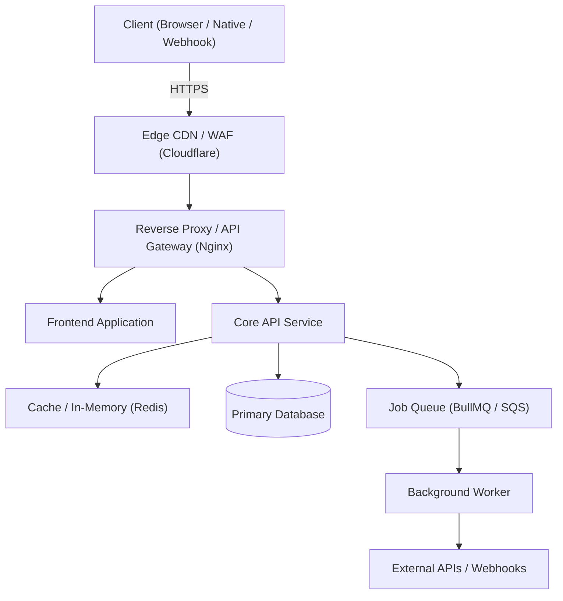
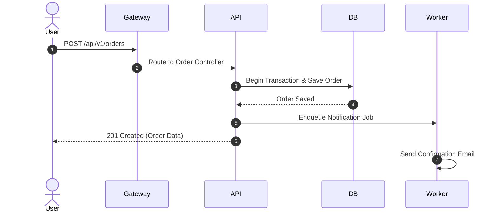

<!-- archguard: synced=none status=unconfirmed date=[YYYY-MM-DD] -->
# ARCHITECTURE.md — [プロジェクト名 / システム名]

> 最終更新: [YYYY-MM-DD] · 同期コミット: `[base-commit-hash]` · ステータス: ◼ 未確定 (初期ドラフト: /architecture-plan 未実行)
> 
> **規律**: 本ドキュメントはソースコードと同期する単一の真実（Single Source of Truth）です。技術要素は可能な限りソースコードのパスと行番号（`file:line`）を直接引用し、コード内に存在しない要素は `> Not Found（未検出）` と明記します。初期導入時は必ず `◼ 未確定` であり、`/architecture-plan` による検証と人間の承認を経て初めて `✅ 確定済` に更新されます。

---

## 記号の定義 (Status Legend)
- `✅` **実装済み (In Code)**: コードが存在し、動作検証済み。
- `◼` **設計確定・未実装 (Planned)**: 仕様・境界は合意済みだが、コード未実装。
- `⚠️` **乖離・要確認 (Drift / Review)**: コードと設計の不一致、または要リファクタリング。
- `~~打消し~~` **廃止・非推奨 (Deprecated)**: 過去の遺産、移行予定。

---

## 目次 (Table of Contents)

1. [プロジェクト概要](#1-プロジェクト概要-project-overview)
2. [技術スタック](#2-技術スタック-tech-stack)
3. [ディレクトリ構造](#3-ディレクトリ構造-directory-structure)
4. [システムアーキテクチャ](#4-システムアーキテクチャ-system-architecture)
5. [モジュール分割 & 境界](#5-モジュール分割--境界-module-decomposition--boundaries)
6. [リクエストフロー](#6-リクエストフロー-request-flow)
7. [認証方式](#7-認証方式-authentication)
8. [認可 & 権限制御](#8-認可--権限制御-authorization)
9. [データベース設計](#9-データベース設計-database-architecture)
10. [APIアーキテクチャ](#10-apiアーキテクチャ-api-architecture)
11. [主要ビジネスフロー](#11-主要ビジネスフロー-business-flows)
12. [依存関係グラフ](#12-依存関係グラフ-dependency-graph)
13. [外部連携サービス](#13-外部連携サービス-external-services)
14. [設定 & 環境変数](#14-設定--環境変数-configuration-management)
15. [ロギング戦略](#15-ロギング戦略-logging--tracing)
16. [エラーハンドリング](#16-エラーハンドリング-error-handling--resilience)
17. [セキュリティ対策](#17-セキュリティ対策-security--hardening)
18. [パフォーマンス基準](#18-パフォーマンス基準-performance--optimization)
19. [スケーラビリティ設計](#19-スケーラビリティ設計-scalability--bottlenecks)
20. [デプロイ & インフラ](#20-デプロイ--インフラ-deployment--infrastructure)
21. [テスト戦略](#21-テスト戦略-testing-strategy)
22. [コーディング規約](#22-コーディング規約-coding-conventions)
23. [状態管理](#23-状態管理-state-management)
24. [非同期 & バックグラウンド処理](#24-非同期--バックグラウンド処理-async--background-workers)
25. [オブザーバビリティ & 監視](#25-オブザーバビリティ--監視-observability--monitoring)
26. [障害復旧 & ロールバック](#26-障害復旧--ロールバック-disaster-recovery--rollback)
27. [アーキテクチャ署名 & 変更履歴](#27-アーキテクチャ署名--変更履歴-architecture-signature--changelog)

---

### 1. プロジェクト概要 (Project Overview)
- **事業目的**: [誰のどのような課題を解決するか]
- **対象ユーザー**: [一般ユーザー、管理者、外部APIクライアント等]
- **稼働目標 (SLA)**: [稼働率99.9%、最大応答速度500ms等]
- **品質レベル (Kanau OS)**: `Q1 Prototype` / `Q2 Pilot` / `Q3 Production` / `Q4 Critical`

---

### 2. 技術スタック (Tech Stack)
| レイヤー | 技術 / ライブラリ | バージョン | 採用理由 / 根拠 | 状態 |
|---|---|---|---|---|
| Runtime | [例: Node.js / Python / Go] | | | ◼ |
| Frontend | [例: Next.js / React / Vue] | | | ◼ |
| Backend | [例: Express / FastAPI / NestJS] | | | ◼ |
| Database | [例: PostgreSQL / MySQL] | | | ◼ |
| Cache/Queue | [例: Redis / BullMQ] | | | ◼ |
| Cloud/Infra | [例: AWS / Docker] | | | ◼ |

---

### 3. ディレクトリ構造 (Directory Structure)
```text
/
├── src/
│   ├── config/          # 環境変数・初期設定
│   ├── modules/         # ドメイン別モジュール (Vertical Slice)
│   ├── middleware/      # 認証・ログ・エラー共通ミドルウェア
│   └── shared/          # 汎用ユーティリティ
├── docs/                # プロジェクト仕様・運用設計書
└── tests/               # 単体・結合・E2Eテスト
```

---

### 4. システムアーキテクチャ (System Architecture)


---

### 5. モジュール分割 & 境界 (Module Decomposition & Boundaries)
- **モジュール間結合の規律**:
  - `modules/A` は `modules/B` の内部実装を直接インポートしてはならない。公開された Service または Interface 経由でのみ通信する。
  - 循環参照（Circular Dependency）は絶対禁止。

---

### 6. リクエストフロー (Request Flow)
1つのリクエストがAPI内部を通過する4層処理モデル:
1. `AuthN/AuthZ Layer`: JWT/Session検証、リクエストコンテキスト注入
2. `Controller & Validation`: Zod/Pydantic等によるスキーマ検証、DTO生成
3. `Service / Domain Logic`: 業務ルールの適用、トランザクション境界
4. `Data Access / Integration`: ORMによる永続化、イベント発火、レスポンス返却

---

### 7. 認証方式 (Authentication)
- トークン仕様: [例: JWT (Access Token 15分 / Refresh Token 7日) / Session / Not Found]
- トークン保存先: [例: httpOnly, Secure, SameSite=Lax Cookie / Authorization Header]

---

### 8. 認可 & 権限制御 (Authorization)
- ロール定義: [例: SuperAdmin, TenantAdmin, Member, Guest]
- マルチテナント分離方針: [例: テナントIDによる行レベルセキュリティ (RLS) またはクエリフィルタ強制 / Not Applicable]

---

### 9. データベース設計 (Database Architecture)
- エンジン & バージョン: [例: PostgreSQL 16 / MySQL 8.0]
- マイグレーションツール: [例: Prisma / Drizzle / Flyway]
- 接続プール設定: [例: 最大コネクション数、タイムアウト規約]

---

### 10. APIアーキテクチャ (API Architecture)
- 通信プロトコル: REST (JSON) / WebSocket
- 共通レスポンスエンベロープ:
```json
{
  "success": true,
  "data": {},
  "error": null,
  "meta": { "timestamp": "ISO-8601", "traceId": "uuid" }
}
```

---

### 11. 主要ビジネスフロー (Business Flows)


---

### 12. 依存関係グラフ (Dependency Graph)
- 主要モジュール間の依存方向 (`A -> B`) の確認。循環依存の有無。

---

### 13. 外部連携サービス (External Services)
| サービス名 | 用途 | 認証方式 | タイムアウト設定 | フォールバック |
|---|---|---|---|---|
| [例: Stripe] | [決済処理] | [API Key (Secret)] | [5000ms] | [Webhookでの非同期確認] |
| [例: SendGrid] | [メール送信] | [API Key] | [3000ms] | [キューへ再エンキュー] |

---

### 14. 設定 & 環境変数 (Configuration Management)
- `.env.example` に全変数を網羅。本番環境の機密情報は AWS Secrets Manager / KMS 等で管理。

---

### 15. ロギング戦略 (Logging & Tracing)
- ログフォーマット: JSON形式 (タイムスタンプ, ログレベル, traceId, message, context)
- ログ出力先: `stdout` (Dockerコンテナ標準) ➔ 収集エージェント ➔ 集中管理

---

### 16. エラーハンドリング (Error Handling & Resilience)
- 予期せぬ例外のグローバルキャッチと安全な500エラー応答。内部スタックトレースはクライアントに漏洩させない。

---

### 17. セキュリティ対策 (Security & Hardening)
- CORS設定、Helmetヘッダー、Rate Limiting (IP/User単位)、SQLインジェクション対策、XSS/CSRF防止。

---

### 18. パフォーマンス基準 (Performance & Optimization)
- APIレスポンス目標: p95 < 300ms
- N+1問題の防止 (Eager Loading / Dataloader)
- キャッシュ方針: Redis Cache-Aside パターン

---

### 19. スケーラビリティ設計 (Scalability & Bottlenecks)
- ステートレス設計（セッションはRedisまたはJWTで外部化）
- ボトルネック想定: DBコネクション枯渇 ➔ コネクションプーラー (PgBouncer) 導入

---

### 20. デプロイ & インフラ (Deployment & Infrastructure)
- Dockerコンテナ化、CIパイプラインによる自動テスト・Lint、CDによる自動ロールアウト。

---

### 21. テスト戦略 (Testing Strategy)
- Unit Test (Vitest / Jest / Pytest): ドメインロジックの網羅
- Integration Test: APIエンドポイントとDBの結合検証
- E2E Test (Playwright): 主要導線のブラウザ自動テスト

---

### 22. コーディング規約 (Coding Conventions)
- 命名規則: ファイル名 (kebab-case), クラス (PascalCase), 変数/関数 (camelCase)
- コミット規則: Conventional Commits (`feat:`, `fix:`, `refactor:`, `docs:`)

---

### 23. 状態管理 (State Management)
- クライアント側: Server State (TanStack Query / SWR) と UI State (Zustand / useState) の分離。

---

### 24. 非同期 & バックグラウンド処理 (Async & Background Workers)
- キューエンジン: [例: BullMQ / AWS SQS / None]
- リトライポリシー: [例: 指数バックオフ (Max 3回) ➔ Dead Letter Queue (DLQ) / Not Applicable]

---

### 25. オブザーバビリティ & 監視 (Observability & Monitoring)
- ヘルスチェックエンドポイント: `GET /health` (DB・Redis死活確認)
- 障害通知: Slack / Telegram / Alertmanager

---

### 26. 障害復旧 & ロールバック (Disaster Recovery & Rollback)
- DBバックアップ頻度: 日次フル + WALアーカイブログ
- ロールバック手順: コンテナイメージの直前タグへの即時ロールバック

---

### 27. アーキテクチャ署名 & 変更履歴 (Architecture Signature & Changelog)

#### モジュール登録台帳 (Module Signature Registry)
| モジュール名 | レイヤー | 依存先 (Imports) | 被依存 (Used By) | 入力 / 出力 | 状態保持 | リスク |
|---|---|---|---|---|---|---|
| [module_name] | [Layer] | [imports] | [used_by] | [DTO/Events] | [Stateless/Stateful] | [Low/Med/High] |

#### アーキテクチャ変更履歴 (Changelog)
- [YYYY-MM-DD] · `[initial-hash]` · 初期アーキテクチャドラフト作成 · 更新項目: 全章 (§1-§27)
